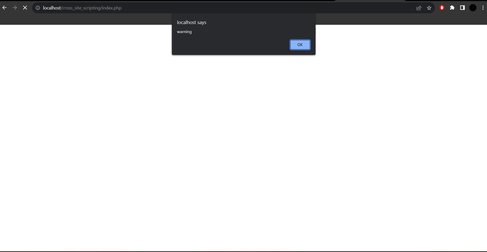

# Cross_Site_Scripting-XSS-demo
This is the simple XSS Attack demo, *(Educational purpose :)) ...How it works-> it is a simple page that allows user to comment and see comments of other users. If any user Attacks by XSS, using script payload, the script is stored as it is if there is no proper sanitization of user input(comment) . then after script is stored , if any other user login to the page he might be victim of payload...
ex: 

